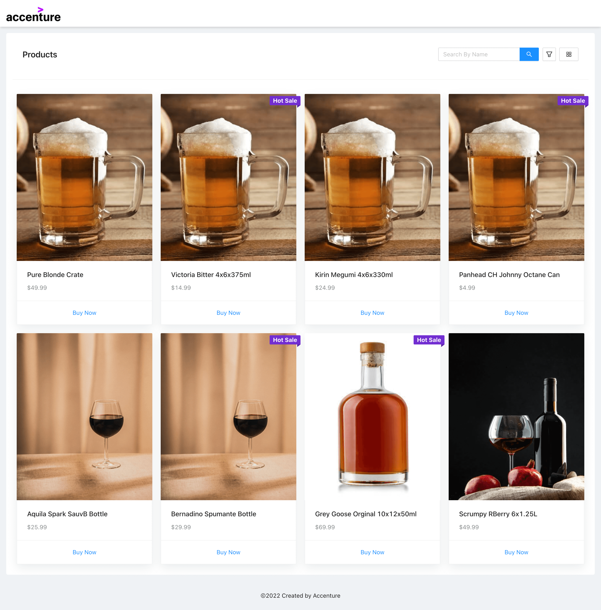
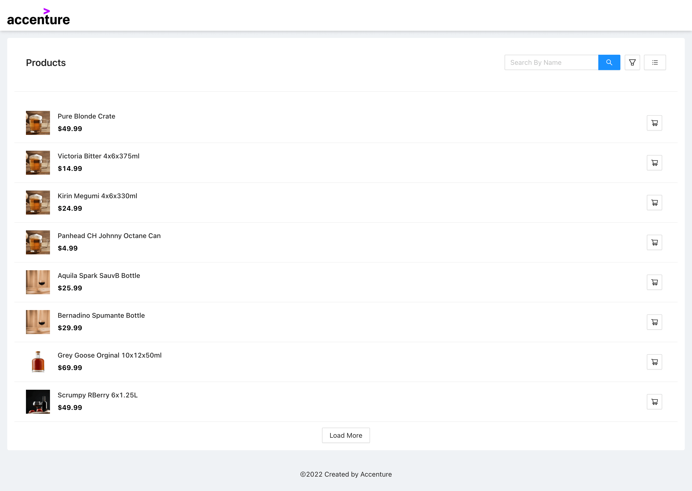
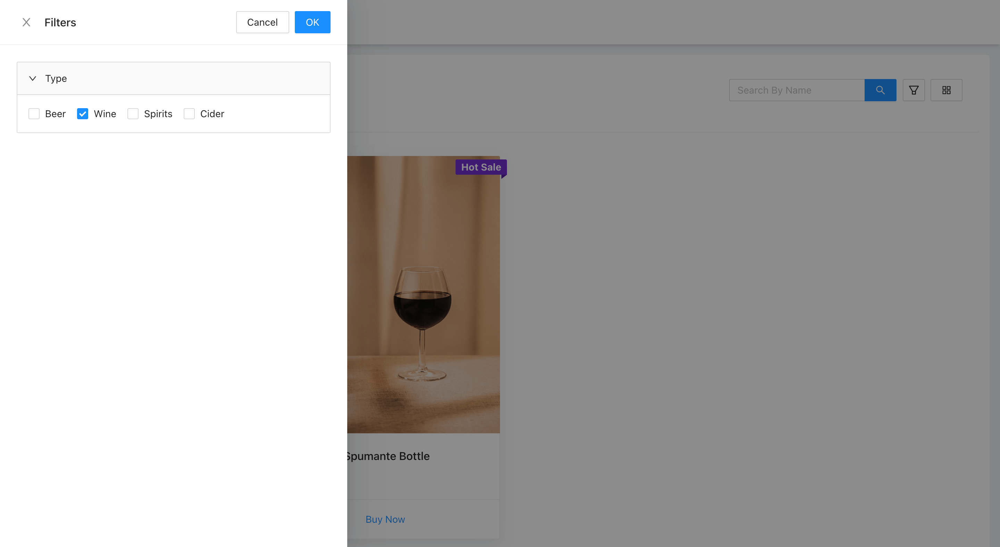
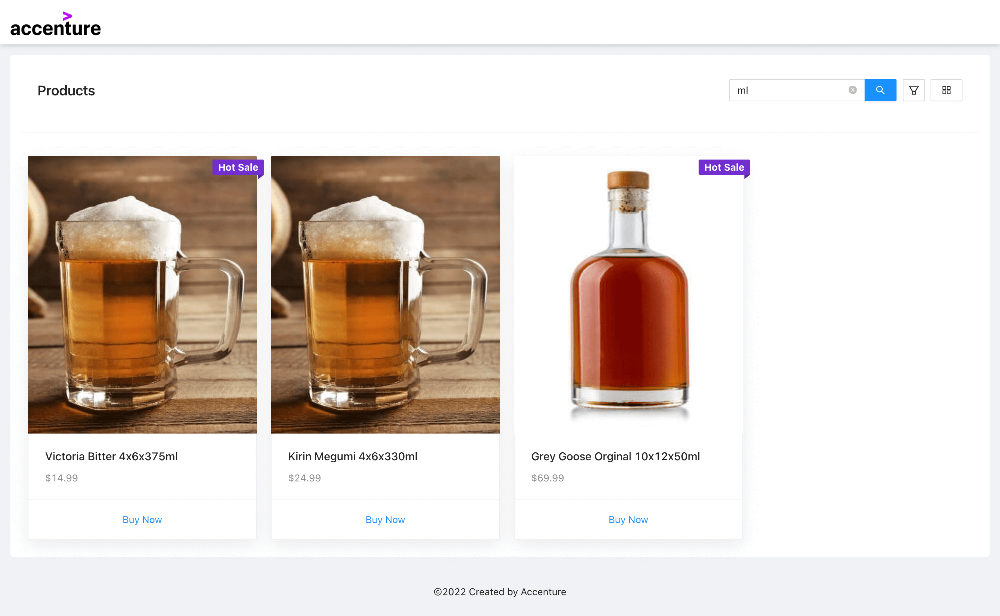

# Accenture Assignment
Build a product listing page with React JS

# URL 
https://main.d3bnt6kasn87j4.amplifyapp.com
## Technologies:
Following tech stack were used
- HTML
- CSS
- Javascript
- Typescript
- antd Design
- axios

## ENV
.env file has been committed for assignment purpose only. Do not use it for production env.
- REACT_APP_BASEURL="http://localhost:3001/accenture/"
- REACT_APP_BASEURL="https://oqpqxravi1.execute-api.ap-southeast-2.amazonaws.com/accenture/"

## API Info
- Ensure to start the backend api support before this application
## Setup
- download or clone the repository
- run `yarn`
- run `yarn start`

## Lint Check
- run `yarn lint`

## Format 
- run `yarn format`

## Screenshots

## Credits
List of contriubutors:
- [Govindharaju](govindharaju.k@gmail.com) 

## License

MIT license @ [author](author.com)