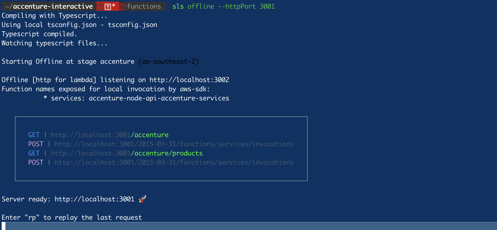

# Accenture Assignment 
Node JS with serverless application
## Technologies:
Following tech stack were used
- aws-lambda
- aws-serverless-express
- axios
- Typescript
- cors
- dotenv
- moment
- morgan
- serverless-http  

## Setup
- download or clone the repository
- run `yarn`
- run offline `sls offline --httpPort 3001`
- run production `sls deploy --<aws-profile>`

## Screenshots

## API Info
- This application is developed with node and serverless
- Make sure port:3001 should be there in front-end .env file.  
## Credits
List of contriubutors:
- [Govindharaju](govindharaju.k@gmail.com) 

## License

MIT license @ [author](author.com)